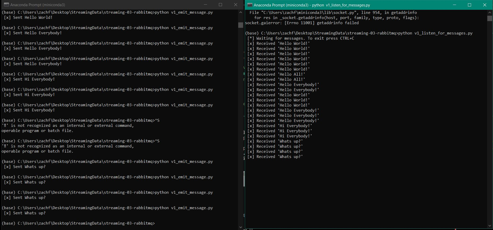

# streaming-03-rabbitmq

Get started with RabbitMQ, a message broker, that enables multiple processes to communicate reliably through an intermediary

## Before You Begin

1. Fork this starter repo into your GitHub.
1. Clone your repo down to your machine.
1. In VS Code with Python extension, click on emit_message_v1.py to get VS Code in Python mode.
1. View / Command Palette - then Python: Select Interpreter
1. Select your conda environment. See the references below for more.
1. Use the terminal to install pika into your active environment. 

`conda install -c conda-forge pika`

## Read

1. Read the [RabbitMQ Tutorial - Hello, World!](https://www.rabbitmq.com/tutorials/tutorial-one-python.html)
1. Read the code and comments in this repo.

    It seems that RabbitMQ is written entirely in python and works with versions 3.7 on up.

## Execute about,py

1. Run about.py.
1. Read about.txt. 
1. Verfiy you have exactly one active, one None env.
    Both my pip and conda env were originally None. I had to look into this a bit, and I found that if I activate my base environment in Anaconda Prompt and then execute the phrase "code", it will open VS code with my base environment set. I found this solution at:
    https://stackoverflow.com/questions/61986052/visual-studio-code-terminal-doesnt-activate-conda-environment
    However, when I tried to install pika using the directions provided this way, it was running into conflicts with a package "setuptools" and I was unable to install. So, I opened VS Code as I did before and went through it without first activating my base environment in Anaconda Prompt. However, I soon realized that I could use 'pip install pika' in my base environment to install pika, and that worked without issue.

## Version 1 - Execute the Producer/Sender

1. Read v1_emit_message.py (and the tutorial)
1. Run the file. 

You'll need to fix an error in the program to get it to run.
Once it runs and finishes, we can reuse the terminal.

I needed to install pika using the command provided, but this prompted me to update conda as well, which I did.

## Version 1 - Execute the Consumer/Listener

1. Read v1_listen_for_messages.py (and the tutorial)
1. Run the file.

You'll need to fix an error in the program to get it to run.
Once it runs successfully, will it terminate on its own? How do you know? 
As long as the process is running, we cannot use this terminal for other commands. 

    The error was that LocalHost was spelled incorrectly. It will not terminate on it's own, as it continues to wait for a message. The if __name__ == __main__ line says that it will try the function main() unless it encounters an error or until it is forcibly stopped by ctrl+C.

## Version 1 - Open a New Terminal / Emit More Messages

1. Open a new terminal window.
1. Use this new window to emit more messages
1. In v1_emit_message.py, modify the message. 
1. Execute the script. 
1. Watch what happens in the listening window.
1. Do this several times to emit at least 3 different messages.

    The name of the queue is "hello." I originally just changed the body of the message in the v1_emit script's basic.publish() function and saw the received messages in the v1_listen output change. However, following the directions of creating a variable to update the body of the message that is received and what is displayed to the sender is more efficient.

## Version 1: Don't Repeat Yourself (DRY)

1. Did you notice you had to change the message in two places?
    1. You update the actual message sent. 
    1. You also update what is displayed to the user. 
1. Fix this by introducting a variable to hold the message. 
    1. Use your variable when sending. 
    1. Use the variable again when displaying to the user. 

To send a new message, you'll only make one change.
Updating and improving code is called 'refactoring'. 
Use your skills to keep coding enjoyable. 

## Version 2

Now look at the second version of each file.
These include more graceful error handling,
and a consistent, reusable approach to building code.

Each of the version 2 programs include an error as well. 

1. Find the error and fix it. 
    The host declaration for the local host was again misspelled in both files.
1. Compare the structure of the version 2 files. 
1. Modify the docstrings on all your files.
1. Include your name and the date.
1. Imports always go at the top, just after the file docstring.
1. Imports should be one per line - why?
    This makes things more readable and clear. Also, when using a version control system like GitHub, having multiple imports on one line can potentially lead to merge conflicts.
1. Then, define your functions.
1. Functions are reuable logic blocks.
1. Everything the function needs comes in through the arguments.
1. A function may - or may not - return a value. 
1. When we open a connection, we should close the connection. 
1. Which of the 4 files will always close() the connection?
    All 4 of the files v1_emit_message.py, v1_listen_for_messages.py, v2_emit_message.py, and v2_listen_for_messages.py use close() to close a connection. All of these are contained within the main() functions that are defined in each file.
1. Search GitHub for if __name__ == "__main__":
1. How many hits did you get? 
    There are 9 million code results that match this. This is a very common python idiom, as it is a way to access all necessary functions in a .py file/module with one run of the file.
1. Learn and understand this common Python idiom.

## Reference

- [RabbitMQ Tutorial - Hello, World!](https://www.rabbitmq.com/tutorials/tutorial-one-python.html)
- [Using Python environments in VS Code](https://code.visualstudio.com/docs/python/environments)

